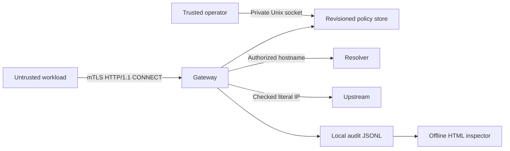

# Architecture

RelayFence is one Go process with a durable local policy, synchronous audit writer and local Unix administration socket. There is no distributed state or high-availability coordination.

## Connection lifecycle

1. Verify TLS client trust and extract exactly one workload URI identity.
2. Parse and canonicalize the CONNECT request-target; reserve an authorized identity/destination slot before DNS.
3. Resolve once, validate the entire bounded answer set and dial the first sorted approved literal IP once.
4. Attach the upstream only if the reservation's revision and context remain current.
5. Sync an admission audit record, attach the client under the same revision check and send `200 Connection Established`.
6. Relay opaque bytes with a shared budget and deadlines; record closure and release the reservation once.

`Store.mu` serializes admission, policy comparison, persistence and attachment. Reservations include pending DNS/dial work in both global and identity counts. Each has an absolute deadline and cancellable context. Session socket bookkeeping has its own mutex; cancellation closes transports outside the store lock. A late dial result cannot attach to an obsolete revision.

Every successful policy replacement cancels all old sessions, including unchanged grants. Failure during persistence poisons admission and cancels sessions because durable state may be ambiguous. Shutdown explicitly closes hijacked CONNECT sockets and joins handlers; HTTP listener shutdown alone would be insufficient.

## DNS and relay

Authorization uses exact canonical hostname and port, with no wildcard or suffix rule. Every returned address must pass the conservative classifier. IPv4-mapped addresses are unmapped; one prohibited answer rejects the whole set. The dialer receives a literal address and performs no second name lookup. There is no fallback address, retry or Happy Eyeballs path.

Two copying goroutines use fixed 32 KiB buffers. An atomic reservation budget covers both directions before writes. Short writes can consume unused quota conservatively; actual successfully written bytes are counted separately. EOF propagates half-close where supported while the opposite direction drains. Errors, budget exhaustion, idle expiry or absolute lifetime close both transports. Pending and connected sessions release their admission slot exactly once.

## Storage and audit

Policy replacement writes a same-directory temporary file, syncs it, renames it and syncs the directory. It assumes local filesystem semantics. Invalid or stale updates leave live policy unchanged; persistence uncertainty requires recovery before new grants.

The audit writer serializes records, syncs each append and verifies the existing hash chain at startup. Admission audit failure prevents payload forwarding; any gateway audit failure poisons future admission and cancels sessions. Close-record failure cannot undo earlier traffic. Audit files are capped at 16 MiB and require offline rotation. The inspector verifies the chain before rendering with `html/template` escaping.

## Host boundary

The proxy controls traffic routed through it. A separate Linux namespace profile restricts the workload to the gateway endpoint and removes its capabilities. The [containment laboratory](infra/containment.md) exercises that topology with positive controls and receiver-side observations. The trusted operator, CA, host kernel and same-user/root access remain outside the core boundary.
