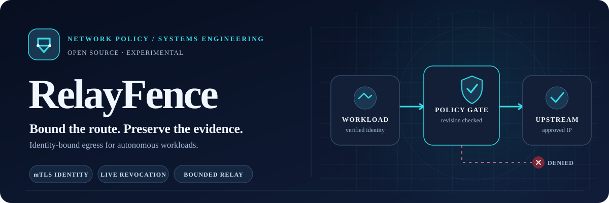
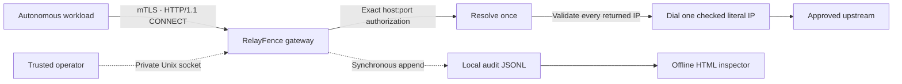

<p align="center">
  <picture>
    <source media="(prefers-color-scheme: dark)" srcset="assets/relayfence-hero-dark.svg">
    <source media="(prefers-color-scheme: light)" srcset="assets/relayfence-hero-light.svg">
    
  </picture>
</p>

<p align="center">
  <a href="https://github.com/C-X1an/relayfence/actions/workflows/ci.yml"></a>
  <a href="go.mod"></a>
  <a href="LICENSE"></a>
  
</p>

<p align="center">
  <strong>Network permissions belong in a policy, not a prompt.</strong><br>
  An experimental, single-host egress gateway for autonomous tools, built to make outbound connections<br>
  <strong>identity-bound, explicitly allowed, revocable, bounded and inspectable.</strong>
</p>

<p align="center">
  <a href="#quickstart">Quickstart</a> ·
  <a href="#how-it-works">Architecture</a> ·
  <a href="#verification">Verification</a> ·
  <a href="#security-boundary">Security boundary</a> ·
  <a href="#documentation">Documentation</a>
</p>

---

## The idea

Autonomous workloads often need to reach the network. A prompt can *request* restraint; it cannot enforce a socket-level destination policy. **RelayFence mediates connections explicitly routed through its gateway** using authenticated workload identity, exact destination grants and limits that apply throughout a session.

| **01 / Identify** | **02 / Authorize** | **03 / Bound** | **04 / Account** |
|:--|:--|:--|:--|
| Verified mTLS workload URI, not a user-supplied header | Exact `hostname:port` allowlists; every DNS answer checked before dialing | Revision-fenced revocation, admission ceilings, shared byte budgets and deadlines | Synchronous local JSONL audit with hash-chain verification and escaped HTML inspection |

No LLM account, managed cloud service, database or third-party runtime dependency is necessary for the core. The gateway is implemented with the **Go standard library**.

## Quickstart

**Prerequisites:** Linux (or WSL2/Linux VM on Windows), **Go 1.27.1**, Python 3.11+, Git and `make`. Race detection also needs a C compiler.

```bash
git clone https://github.com/C-X1an/relayfence.git
cd relayfence
make bootstrap
make demo
make inspect
```

`make demo` exercises **real mTLS and TCP sockets** with ephemeral test certificates and an explicitly labelled *loopback DNS fixture*. It checks an approved connection, a denied destination and live revocation, then generates a local HTML audit view. `make inspect` locates the latest generated view under the ignored `verification/` directory.

To build and run the ordinary verification suite:

```bash
make verify
```

`make build` also produces `bin/relayfence` and `bin/relaybench`. For fresh-checkout verification, commit your changes first and run `make clean-verify`. No production certificates or API keys are required for the demo.

## How it works



**The crucial ordering:** authenticate → authorize and reserve capacity → resolve and validate → dial → recheck the policy revision → audit admission → establish the tunnel. Pending work consumes admission capacity; a stale or revoked reservation cannot attach. During forwarding, both directions share the same per-session budget. Replacing a policy closes sessions from the previous revision, even if their grants are unchanged.

<details>
<summary><strong>Explore the implementation by subsystem</strong></summary>

| Subsystem | Source |
|:--|:--|
| Authentication, request lifecycle and relay | [`gateway.go`](internal/relayfence/gateway.go) |
| Host/port and address validation | [`address.go`](internal/relayfence/address.go) |
| Policy revisions, admission and persistence | [`policy.go`](internal/relayfence/policy.go) · [`store.go`](internal/relayfence/store.go) |
| Bidirectional byte reservations | [`budget.go`](internal/relayfence/budget.go) |
| Administration and audit trail | [`admin.go`](internal/relayfence/admin.go) · [`audit.go`](internal/relayfence/audit.go) |
| Real-socket demo and benchmark harness | [`demo.go`](internal/relayfence/demo.go) · [`benchmark.go`](internal/relayfence/benchmark.go) |

</details>

## Verification

This project treats test execution, security boundaries and performance claims as **things to demonstrate, not badges to assert**. The linked CI badge reflects the actual workflow state; the commands below reproduce the corresponding checks locally.

| Check | Run | What it establishes |
|:--|:--|:--|
| Build, formatting, vet, Go tests, race and source audit | `make verify` | Ordinary local verification |
| Parser fuzzing and targeted negative controls | `make fuzz mutation` | Selected tests detect deliberate defects |
| Real-socket demo | `make demo` | Allowed, denied and revoked connection paths |
| Synthetic benchmark | `make benchmark` | Reproducible same-host observations, **not production capacity** |
| Clean committed checkout | `make clean-verify` | Rebuild/retest in a fresh local checkout |
| Linux containment laboratory | `make containment` | Separate host-boundary experiment; requires privileged disposable Linux |
| Online vulnerability check | `make security-online` | Supported-toolchain and vulnerability scan; network required |

Read [benchmark methodology and bounded historical observations](BENCHMARKS.md) before quoting timings. Public CI also runs scanner and CodeQL jobs; it does **not** run privileged containment. Generated logs, test keys and HTML inspection artifacts are local and ignored by Git.

## Security boundary

> [!IMPORTANT]
> **RelayFence is not a standalone sandbox or an audited production security boundary.** It only governs traffic routed through the proxy. A workload with another network route can bypass it; enforced host containment must be supplied and separately tested.

The CONNECT payload is opaque. This gateway does **not** inspect inner TLS, authorize HTTP paths, prevent an approved endpoint from relaying traffic, detect prompt injection or coordinate quotas across multiple hosts. Revocation cannot retract bytes already sent; the local hash chain cannot defeat a privileged actor who replaces the records.

Start with the [threat model](THREAT_MODEL.md), [limitations](LIMITATIONS.md) and [Linux containment laboratory](infra/containment.md) before treating it as part of any security-sensitive environment.

## Documentation

| Start here | Go deeper |
|:--|:--|
| **[Architecture](ARCHITECTURE.md)** — lifecycle, state and trust boundaries | **[API & configuration](API_SPEC.md)** — identity, CONNECT, policy, administration |
| **[Demo & operations](DEPLOYMENT_AND_OPERATIONS.md)** — commands, service setup, recovery | **[Threat model](THREAT_MODEL.md)** — assumptions, threats and residual risk |
| **[Benchmarks](BENCHMARKS.md)** — methodology, caveats, results | **[Limitations](LIMITATIONS.md)** — precise non-goals and operational constraints |
| **[Contributing](CONTRIBUTING.md)** — testing and pull-request conventions | **[Security policy](SECURITY.md)** — responsible vulnerability reporting |

---

<p align="center">
  <strong>Design for the failure path, not just the happy path.</strong><br>
  <sub>Go · mTLS · explicit policy · concurrency · reproducible experiments</sub><br><br>
  Original source licensed under <a href="LICENSE">MIT</a> · Experimental engineering reference · No stable release or production warranty
</p>